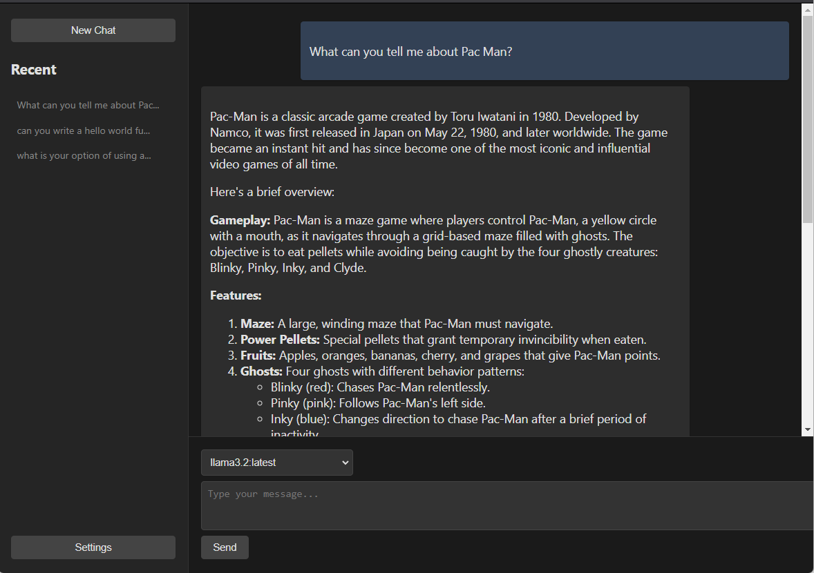

# Ollama Chat

Right now, this is little more than a [single-page-app](./src/index.html) that provides a chat interface to a locally installed and running [Ollama](https://ollama.com/)  instance.

You just need to run it.

> `python -m http.server`, `bun run ollama.html`, `live-server`, whatever...

## Features

- Chat with Ollama (w/ context)
- Select from installed models
- Render conversation in Markdown for readablility
- Chat History (localStorage)
- Dark Mode

### Future

- Basic Settings (localStorage)
- Improve UI
- Add PWA Features
- Build as a [Neutralino App](https://neutralino.js.org/)
- Export / Import conversations
- More...

## Why

Because I dont think gigs of resources are need to have a nice web chat interface.

## Goals

- Keep it small
- Keep it useful
- Keep it Focused on Ollama
