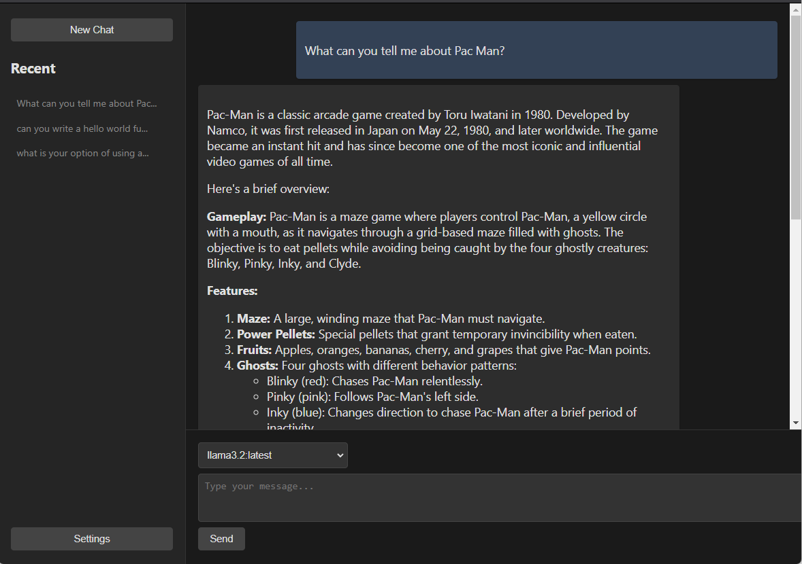

# Ollama Chat

Right now, this is little more than a [single-html-file](./src/ollama.html) that provides a chat interface to a locally installed and running [Ollama](https://ollama.com/)  instance.

You just need to run it.

> `python -m http.server`, `bun run ollama.html`, `live-server`, whatever...

## Features

- Chat with Ollama
- Select from installed models
- Render conversation in Markdown for readablility
- Chat History in Local Storage
- Dark Mode

### Future

- Build as a [Neutralino App](https://neutralino.js.org/)
- Add PWA Features
- Basic Settings
- Export / Import conversations
- Improve UI
- More...

## Why

Because I dont think you should need to use gigs of resources just to have a nice web chat interface.

## Goals

- Keep it small
- Keep it useful
- Keep Focus on Ollama
